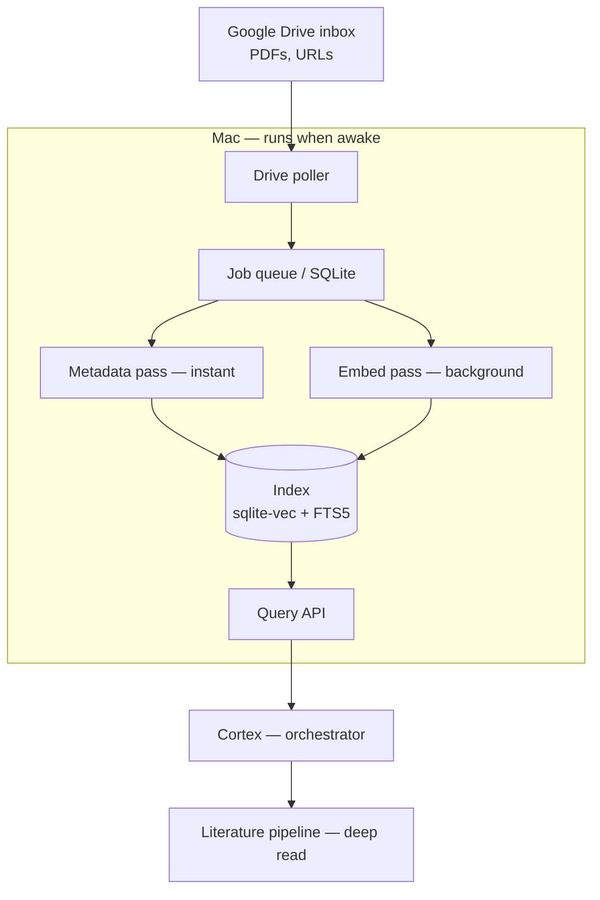
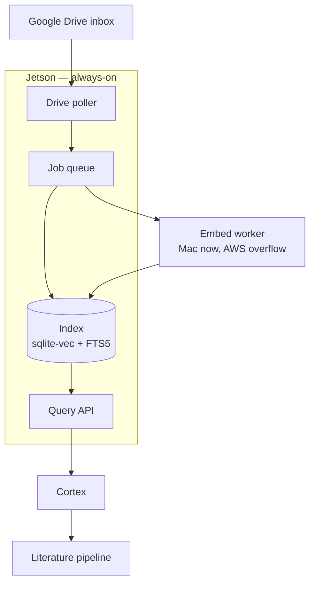

# PAPER FINDER — MEMORY BANK

**Version:** 2.1
**Status:** Tier A + relationship layer BUILT and verified, including **live against a real Google Drive** (scoped crawl, Drive-shortcut following, in-place PDF/Word/PowerPoint extraction, reconcile). Remaining wire-up: swap in the real embedder (`STEmbedder`) before indexing the full corpus.
**Working name:** `paper-finder` (placeholder — broader than papers; rename at will)
**Owner:** John Chan / BioRatio
**Relationship to Cortex:** Standalone tool. Cortex is the orchestrator that *calls* it; the finder does not live inside Cortex.

## 0. Implementation status (what exists today)

Built, runs, and passes four self-test suites under `tests/` (`test_tier_a`,
`test_relationship`, `test_drive_and_reconcile`, `test_filetypes`), each using its own
throwaway DB so the real index is never touched. Installed as a package (`pip install -e .`,
`paperfinder` command). Layout: `paperfinder/core/` (capture, finder, vectorstore),
`paperfinder/graph/` (relationship, viz), plus `api.py`, `cli.py`, `sampledata.py`.

- **Capture seam** (`core/capture.py`): `LocalFolderSource` + `GoogleDriveSource`
  — scoped, **in-place**, over a curation folder: `crawl()` follows **Google Drive
  shortcuts** (folder + file) to their targets even outside the folder, keyed to target id
  (dedup); `poll()` watches resolved folders for new papers; `find_folder_ids` resolves
  names→ids; `run_backfill` drives it. Mix of physically-moved folders and shortcuts
  supported. Shared Drives intentionally out of scope. **Verified live against a real Drive.**
  Note: aliases must be **Drive shortcuts**, not macOS Finder aliases — a Finder alias syncs
  as opaque `application/drive-fs.osx.alias` the API can't resolve; the crawl warns and skips it.
- **Reconcile** (`PaperFinder.reconcile`, run by `backfill`): papers no longer reachable
  (deleted, or folder/shortcut removed) are **archived** — dropped from search, row + authenticated
  relationships preserved, reversible on re-index. Local index only, never touches Drive.
- **Core** (`core/finder.py`): SQLite job queue with durable rehydrate, parser
  (**PDF via pypdf, Word via python-docx, PowerPoint via python-pptx, text/markdown**; Office
  formats need the `office` extra and degrade gracefully without it), staged metadata pass
  (instant, FTS) + embed pass (full text + vectors), hybrid search (FTS5 BM25 + dense, fused by
  RRF). `doc_id` = canonical identity. **Images (.png) skipped by choice** (no text to embed).
- **Vector seam** (`core/vectorstore.py`): `VectorStore` interface + `make_store` factory.
  `BruteForceStore` (default, **verified**); `SqliteVecStore`, `QdrantStore` written but
  **untested here** — verify against installed versions. Progression: brute-force → sqlite-vec
  (true swap, same file) → qdrant (separate service, dual-store).
- **Embedder**: `HashingEmbedder` default (lexical stand-in, dependency-free); `STEmbedder`
  (bge-small via sentence-transformers) selectable by `PAPERFINDER_EMBEDDER=st` — untested here.
- **Query API** (`api.py`): `/search`, `/document/{id}`, `/graph` for Cortex.
- **CLI** (`cli.py`): `sample | backfill | poll | search | viz | serve`. Reads `.env`
  (python-dotenv). Env: `PAPERFINDER_DB`, `PAPERFINDER_REL_DB`, `PAPERFINDER_EMBEDDER`,
  `PAPERFINDER_VECTOR_STORE`.
- **Relationship layer** (`graph/relationship.py`, `graph/viz.py`): provenance-bearing edges
  (human/inferred × candidate/authenticated/rejected), candidate generation from embeddings,
  read-only graph viz. Plugs into the finder's index by shared `doc_id`; verified to survive re-embed.

Verified properties: backfill indexes a folder in one pass; just-dropped docs findable from the
metadata pass before embedding; relevant ranked above noise; results carry canonical id + link;
the staged gap (generic first page, on-topic body) closes after the embed pass; identities and
human-verified edges survive a full re-embed; `.docx`/`.pptx` extracted and searchable; the live
Drive crawl follows a real shortcut and indexes the target folder's documents in place.

Remaining wire-up (not yet done): swap `STEmbedder` in for real semantic recall before indexing
the full corpus; benchmark before deciding on sqlite-vec/Qdrant. Optional later: OCR or a vision
caption for images; native Google Docs export.

---

## 1. Purpose

Semantic + metadata recall over a personal document repository (PDFs, URLs, publications) so that already-collected material on a topic can be found fast — even when it is scattered across many project folders and a Google Drive. Secondary payoff: surfacing connections across projects.

Driving example: "I researched patient sentiment toward AI chatbots in medicine a few days ago and found good papers, but I don't know which folder they're in." The tool answers *"what do I already have on X, and where is it."*

## 2. Scope boundary (what this is NOT)

- This is a **find / recall / connect** tool, not a deep-reading tool.
- Deep reading of a found document is the **literature pipeline's** job. The finder hands a document identity to the pipeline (via Cortex) when depth is wanted.
- The two keep **separate indexes** (different embedding models, different jobs). They agree only on a **canonical document identity**: file path + Google Drive file ID + source URL + DOI (when present). That shared identity is the integration seam.

## 3. Core architecture decisions

1. **Three separate concerns.** Finder (recall/connect) · Literature pipeline (deep read) · Cortex (orchestration + chaining). Linked on demand, not merged.
2. **Staged ingestion.** Two passes per document:
   - *Metadata pass* — runs immediately on drop. Extracts filename, path, dates, title, source URL, DOI, first-page/first-screen text. Item is **findable within minutes**, before embedding.
   - *Embed pass* — runs in the background / batched. Full-text parse + embed for deep semantic recall.
   - This is metadata-*now-then*-embed, not metadata-*instead-of*-embed.
3. **Deterministic pipeline, not an agent.** Detection, parsing, embedding, upsert are a plain pipeline (reliable, cheap, no LLM). LLM is reserved for the genuinely fuzzy work — project classification, title cleanup from junk filenames, dedup, and cross-project connection suggestions. None of that is in v0.
4. **Two pluggable interfaces** are the reason A→B is additive rather than rework:
   - *Capture-source interface* — one operation: yield new/changed documents since the last checkpoint. v0 implements it via the Google Drive API.
   - *Embed-worker interface* — execution target for the embed pass. v0 = local Mac. Later targets: AWS on-demand batch. Selected by policy / Cortex.
5. **Landing zone = a designated Google Drive folder. Change detection via the Drive API** (changes endpoint). Chosen over a local watched folder because it avoids the Drive-desktop placeholder/streaming gotcha, gives one unified inbox reachable from any device, and makes A→B a pure relocation (detector is already API-based). Cost accepted: Drive OAuth + a Google Cloud project + token-refresh handling, pulled into Tier A.
6. **Hybrid search.** Dense vectors + keyword. v0 store = `sqlite-vec` (dense) + FTS5 (keyword), consistent with Cortex and light on the Jetson later. Qdrant (native hybrid/RRF, as in the literature pipeline) is the heavier alternative if needed.

## 4. Tiers

### Tier A — build now (all on Mac, when awake)
- Landing: a Google Drive folder ("inbox").
- Drive API poller → enqueues jobs into a SQLite job queue (status: pending/processing/done/failed; Drive `changes` pageToken as checkpoint).
- Workers on the Mac: metadata pass (instant) and embed pass (background), both upsert into a **local** index (`sqlite-vec` + FTS5).
- Query API endpoint Cortex calls; returns ranked documents with canonical identity + metadata + Drive link.
- One-time **backfill** over existing Drive folder(s) so the current corpus is indexed without manual per-file work.
- Loss vs always-on: ingestion/embedding only happen while the Mac is awake. Acceptable — embeddings are needed eventually, not in real time.

### Tier B — later (always-on capture, opportunistic + overflow compute)
- Relocate the cheap always-on components to the **Jetson** (always-on node): poller, queue, metadata pass, **index**, query API. Dropping and searching now work 24/7.
- **Mac stays the embed worker** (drains the queue when awake).
- **AWS becomes an optional on-demand batch embed worker** draining the same queue (big backfills, or when the queue gets too deep). No standing infra.
- A→B = relocation behind the two interfaces, not a rewrite.

### Tier C — rejected
True always-on *real-time cloud embedding* (24/7 standing cloud infra). Buys nothing for this use case — finding recently-collected papers does not need sub-minute embedding latency, and the queue already guarantees "eventually." Note: "handle processing to AWS later" (decision 4 / Tier B) is an **on-demand batch worker**, which is explicitly NOT Tier C.

## 5. Hardware notes
- Mac: M5 Max, 64GB RAM. Comfortably runs a stronger general embedder than bge-small and overnight batches; can also dispatch heavy jobs to AWS.
- Jetson (reComputer J1020 v2, 4GB, JetPack 4.6.1): suitable as poller / queue / metadata extractor / index host only. **Never the embedder** — 4GB + aging JetPack makes parsing/embedding painful. Treat its age as a liability if asked to do more.

## 6. Success criteria (Tier A / v0)
1. Drop recent "patient sentiment toward AI chatbots" papers into the Drive inbox; query the way the need is actually phrased → correct document(s) ranked above noise.
2. A just-dropped item is findable via the metadata pass **within minutes**, before its embedding completes.
3. Results return a Drive link + canonical identity, so Cortex can hand the document to the literature pipeline.
4. Backfill of the existing corpus is indexed with no manual per-file work.

When these hold, v0 is done — do not gold-plate.

Known v0 gap to measure, not pre-solve: a document whose *content* matches the topic but whose filename and first page are uninformative (e.g. `download(3).pdf` with a generic abstract page) may be missed by the metadata pass until the embed pass catches it. Track how often this bites before investing further.

## 7. Deferred / open (not v0)
- Embedding model choice: bge-small (Cortex default) vs a stronger general model (bge-large / mxbai-embed-large / nomic-embed-text) given 64GB headroom. Decide at v0 validation.
- LLM connection-suggestion layer (cross-project linking).
- Dedup and automatic project classification.
- AWS on-demand batch worker implementation.
- Tier B relocation to the Jetson.
- `sqlite-vec` + FTS5 vs Qdrant final call (defer until corpus size / hybrid-quality data exists).

## 8. Diagrams

### Tier A — all on Mac when awake

### Tier B — always-on capture, compute on Mac/AWS

